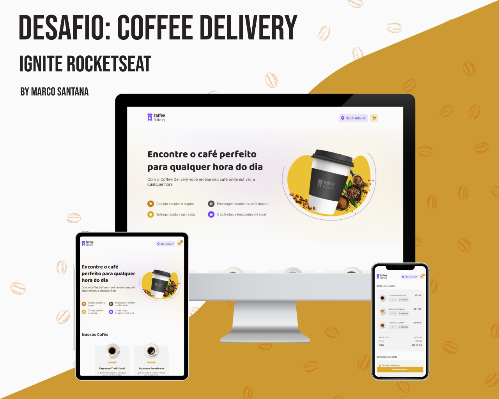

# Desafio Ignite Rocketseat - Coffee Delivery

Este é um desafio onde precisamos praticar os conceitos do ReactJS. Os desafios da Rocketseat, nos ajudam a melhorar nossas habilidades práticas de desenvolvimento, para construir projetos realistas.

## Índice

- [Desafio Ignite Rocketseat - Coffee Delivery](#desafio-ignite-rocketseat---coffee-delivery)
  - [Índice](#índice)
  - [Visão Geral](#visão-geral)
    - [**O desafio**](#o-desafio)
    - [**Captura de tela - Versões Web e Mobile**](#captura-de-tela---versões-web-e-mobile)
    - [**Links**](#links)
  - [Meu processo](#meu-processo)
    - [**Construído com**](#construído-com)
    - [**O que eu aprendi**](#o-que-eu-aprendi)
      - [**Conhecimentos práticos aplicados durante o desenvolvimento**](#conhecimentos-práticos-aplicados-durante-o-desenvolvimento)
    - [**Desenvolvimento continuado**](#desenvolvimento-continuado)
    - [**Recursos úteis**](#recursos-úteis)
  - [Dev - Marco Santana](#dev---marco-santana)

## Visão Geral

### **O desafio**

Nesse desafio, você vai desenvolver uma aplicação para gerenciar um carrinho de compras de uma cafeteria fictícia, que contém as seguintes funcionalidades:

- Listagem de produtos (cafés) disponíveis para compra
- Adicionar uma quantidade específicas de itens no carrinho
- Aumentar ou remover a quantidade de itens no carrinho
- Formulário para o usuário preencher o seu endereço
- Exibir o total de itens no carrinho no Header
- Exibir o valor total da soma de itens no carrinho multiplicados pelo valor

Apesar de serem poucas funcionalidades, você vai precisar relembrar conceitos como:

- Estados
- ContextAPI
- LocalStorage
- Imutabilidade do estado
- Listas e chaves no ReactJS
- Propriedades
- Componentização

### **Captura de tela - Versões Web e Mobile**

### **Links**

- Site URL (Live): <a href="https://coffee-delivery-marco-santana.vercel.app/" target="_blank">Coffee Delivery</a>
- URL do Desafio: <a href="https://efficient-sloth-d85.notion.site/Desafio-02-Coffee-Delivery-30e42a21fdb44b09a85244fc2c3dbdf9#d2d70ac72bc84764b36523fd884ddb41" target="_blank">Desafio 02 - Coffee Delivery</a>

## Meu processo

### **Construído com**

- HTML5
- CSS3
- ReactJS + Vite
- JavaScript
- TypeScript

### **O que eu aprendi**

Neste desafio pude colocar em prática conhecimentos em ReactJS, adquiridos durante o segundo módulo do curso no Ignite.

Foi um projeto desafiador, onde precisei buscar muitas soluções por fora, e isso me deu um maior poder de pesquisa e procura de resoluções. 

Teve momentos em que fiquei literalmente mais de 5 horas, criando diversas lógicas diferentes, para conseguir **compartilhar** corretamente a **quantidade** de **cafés selecionados** entre os componentes, para que assim o valor total de cada item individualmente pudesse ser bem calculado.

A melhor parte foi ver tudo funcionando corretamente, depois de ter passados horas, pensando em uma boa solução.

#### **Conhecimentos práticos aplicados durante o desenvolvimento**
- Estados
- ContextAPI
- Componentes
- Imutabilidade do estado
- Styled Components
- Listas e chaves no ReactJS
- Propriedades
- Componentização
- API viaCEP

### **Desenvolvimento continuado**

Irei focar no terceiro módulo do Ignite a fim de desenvolver minhas habilidades técnicas, e construir melhores soluções para os próximos desafios.

Também irei continuar me desenvolvendo em TypeScript, para construir projetos consistentes, e conseguir trabalhar bem utilizando ReactJS e tudo que ele pode nos oferecer.

### **Recursos úteis**

- [Um Guia completo para Flexbox](https://css-tricks.com/snippets/css/a-guide-to-flexbox/) - Gosto muito de utilizar o site do CSS-Tricks, para aprender sobre CSS, e utilizo muito esta página com dicas práticas de flexbox no CSS.

- [ViaCEP](https://viacep.com.br/) - Com uma simples pesquisa na Web, encontrei este site. Ele é uma simples API que podemos obter endereços através do CEP, gostei muito deste recurso.

## Dev - Marco Santana
 

  